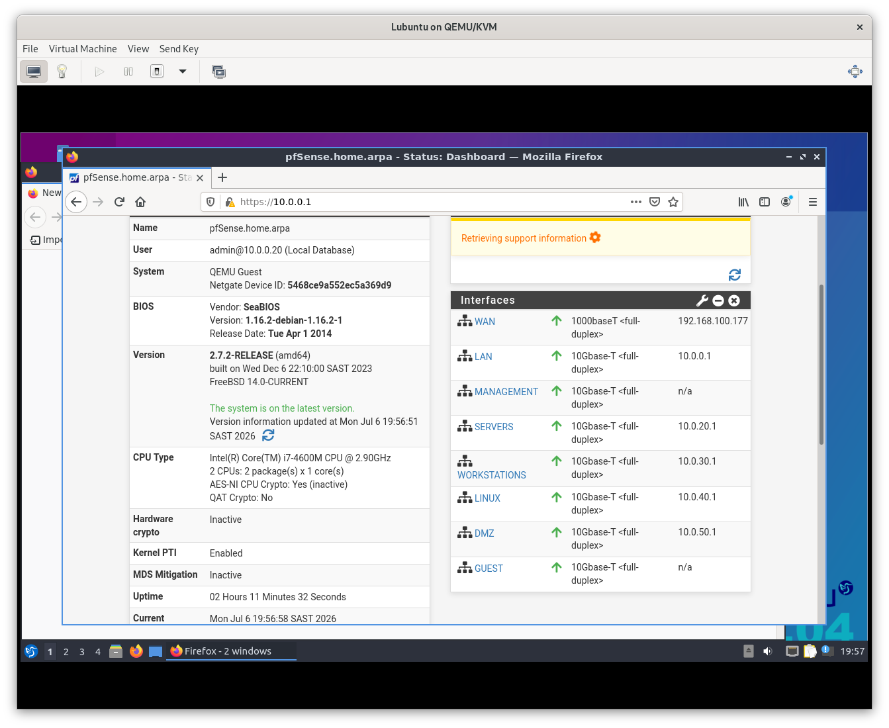
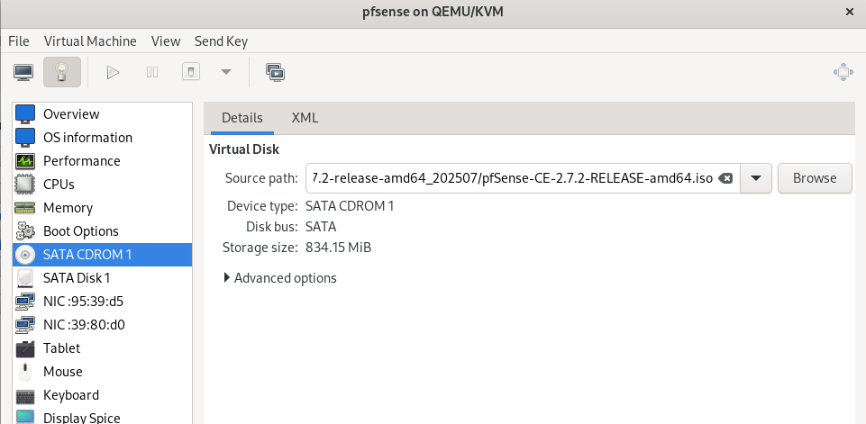
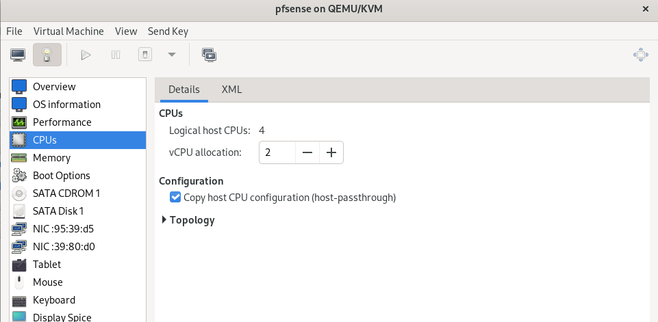
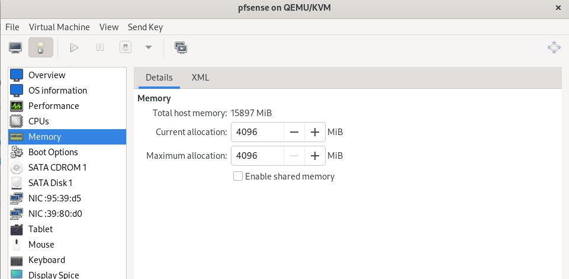
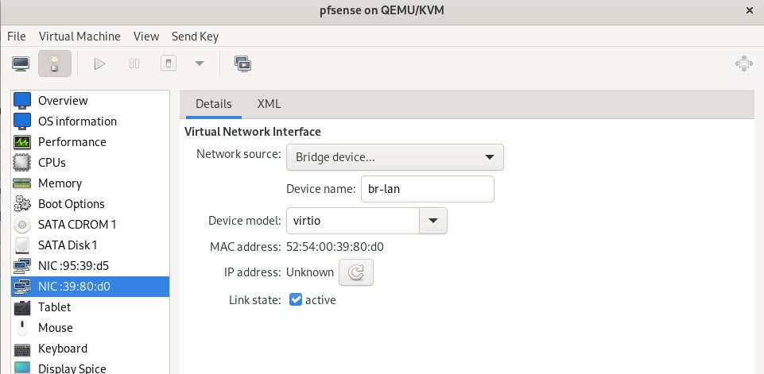
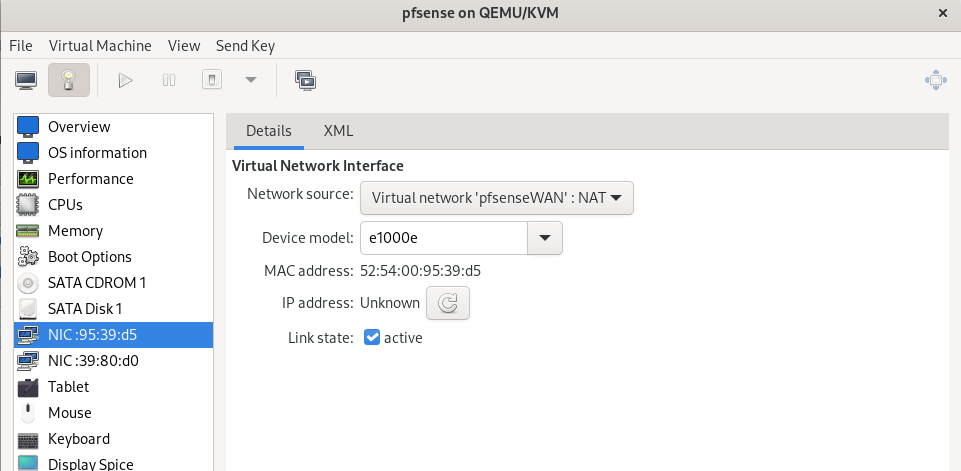
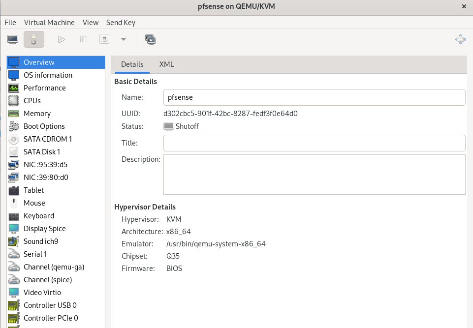
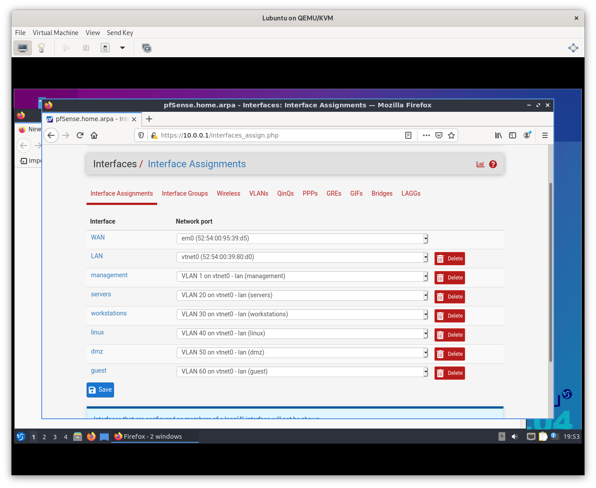

# pfSense Setup 

I did not feel like creating an account to pfsense so I got the ISO from here instead: 
## Overview

pfSense is deployed as the router/firewall for the homelab enviroment.

Responsibilities:
- Provide routing between WAN and LAN networks.
- Provide DHCP services for lab clients.
- Provide fireall rules and network segmentation.
- Act as the default gateway for interal VLANs.
- Provide a controlled internet connection to the Proxmox environment.

## Deployment Details

|Component| Details |
| :--- | :--- |
| Platform | Virtual Machine (virt mananger) |
| Host Hardware | Dell Precision M6800|
| Hypervisor | KVM/QEMU|
| pfSense Version | 2.7.2 |
| WAN Interface | WiFi|
| LAN Interface| Ethernet bridge directly to desktop computer|

# Network Topology

Internet &rarr; Huawei Mobile Router &rarr; USB Tethering &rarr; Dell M6800 &rarr; pfsSense &rarr; LAN bridge &rarr; Proxmox bridge &rarr; Proxmox Server &rarr; Virtual Machines

- Dashboard: 

# Virtual Machine Configuration

## Hardware Allocation

| Resource | Allocation|
| :--- | :--- |
| CPU | 2 cores |
| RAM| |
| Storage | 20GB |
| Network Adapters| 2 |

### WAN Interface

Purpose:
- Receives internet connection from host system

Configuration:

Interface: WAN
Network: Host Wifi bridge
IP Assignment: DHCP

### LAN Interface

Purpose: 
-Internal homelab network

Configuration:

Interface: br-lan
IP Address: 10.0.0.1/24
DHCP Range: ****** 

# Installation process

## Step 1 - Create Virtual Machine

VM Name: pfSense
Firmware: BIOS 
Disk: 20GB
RAM 2048MB
CPU: 2 cores

Screenshots:

- ISO:
 
 Link for exact pfSense version was found here: [pfSense](https://archive.org/details/pfsense-ce-2.7.2-release-amd64_202507)
 
- RAM and CPU allocation:

- Network adapters:

- Overview: 

## Step 2 - Install pfSense

Installation steps:

1. Boot from pfSense ISO (Change boot order if necesarry)
2. Accept license agreement
3. Select Install option
4. Choose filesystem
5. Reboot after installation.

## Step 3: Interface assignment after installion:
 
It should automatically assign the interfaces but if it did not or you want to change them you can manually do it by typing '1' for 'Assign Interfaces' 

Default:

WAN: em0
LAN: vtnet0

I changed the IP Address on the LAN interface to:
IP Address: 10.0.0.1
Subnet: 255.255.255.0/24
DHCP: Enabled

This LAN subnet provides connectivity between:
- pfSense
- Proxmox
- Manangement VM
- Linux services
- Future Active Directory servers
- Client Machines

# Firewall Configuration

## Default Rules

| Interface | Rule | Purpose|
| - | - | - |
| LAN | Allow LAN to Any | Internet users can access internet|
| WAN | Block unsolicited traffic | Protect internal network|
{Insert Screenshot}

# DHCP Configuration

Range: 10.0.0.10 - 10.0.0.100
Gateway: 10.0.0.1
DNS: 10.0.0.1

# Testing

## Connectivity Tests

### pfSense Internet Test

Testing Diagnostics &rarr; Ping
Target: 8.8.8.8

{Insert Screeshot}

### LAN Device Test 

From Manangement VM:
'ping 10.0.0.1'

Internet test
'ping google.com'

Successful DNS resolution
{Insert Screenshot}

# VLAN Configuration

## Interfaces

| Interface | VLAN | Gateway |
|---|---|---|
| LAN | Native | 10.0.0.1 |
| Servers | VLAN 20 | 10.0.20.1 |
| Workstations | VLAN 30 | 10.0.30.1 |
| Linux | VLAN 40 |10.0.40.1 |
| DMZ | VLAN 50 |10.0.50.1 |
| Guest | VLAN 60 | 10.0.60.1 |

- Interface Assignment: 

# Problems Encountered

## Issue: Management VM had not internet access
Symptoms:
    - Can ping pfSense LAN
    - Cannot reach external addresses

Cause: 
    -
 
Resolution:
    -
    -
    -
    -

Results:
    -
    -
    -

# Future Improvements 

Planned Changes:
    - Create VLAns for network segmentation
    - Configure firewall rules between VLANs
    - Add VPN access
    - Enable pfBlockerNG/Pi-hole intergration
    - Configure IDS/IPS using Suricata
